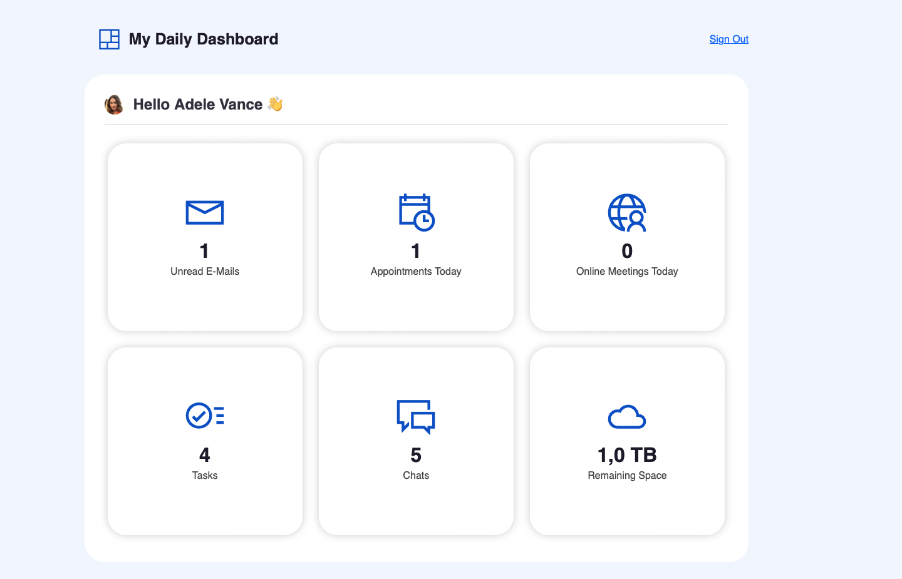

# BlazorGraphDashboard

# Simple Blazor Server app using Microsoft Graph 

- View amount of unread E-Mails
- View amount of appointments of the current day
- View amount of online meetings of the current day
- View amount of all tasks/toDos 
- View amount of remaining space of onedrive

## Setup

### 1. Register an Azure Active Directory app
Follow the instructions to successfully run your Blazor Server app with Microsoft Graph.

### 1. Register an Azure Active Directory app

Every app that uses Azure AD for authentication must be registered with Azure AD. You can register app through Azure Portal or by using Azure CLI. Please follow one of the options to register your app:

<details>
  <summary>Option 1: Register an app by using Azure CLI</summary>

* [Install Azure CLI](https://learn.microsoft.com/cli/azure/install-azure-cli?view=azure-cli-latest) if you haven't already.
* Register your app on Microsoft Azure, by creating a new Azure AD app registration:
    * <details>
        <summary>On macOS/Linux/in Bash</summary>

        * Open terminal and change the working directory to the root of this project
        * To make the setup script executable, run `chmod +x ./setup.sh`
        * To register the app, run `./setup.sh`
        * When prompted, sign in with your **Microsoft 365 developer sandbox account**

      </details>
    * <details>
        <summary>On Windows/in PowerShell</summary>

        * Open PowerShell and change the working directory to the root of this project
        * To register the app, run `.\setup.ps1`
        * When prompted, sign in with your **Microsoft 365 developer sandbox account**

      </details>

</details>

<details>

  <summary>Option 2: Register an app through Azure Portal</summary>

* Go to [Azure Portal](https://portal.azure.com) and login with your testing account that has Application developer or administrator permissions.
* Select **Azure Active Directory**, and select **App Registrations** from the left side bar. Then select **+ New registration**.
* Give any name to your app. For **Supported account types**, select **Accounts in any organizational directory (Any Azure AD directory - Multitenant) and personal Microsoft accounts (e.g. Skype, Xbox)**.
* Set the **Redirect URI** drop down to **Web** and enter `https://localhost:5001/signin-oidc`. Then, select **Register**.
* Select **Certificates & secrets** tab in your registered app, and then **Client secrets**. Create a **New client secret** that never expires.

Make note of the **secret's value** as you'll use it in the next step. Also, navigate to **Overview tab** and make a note of the **Application (client) ID** and **Directory (tenant) ID**. You'll use them in the next steps.

</details>

### 2. Run your Blazor Server app

* Clone the Hack Together repository to your local workspace or directly download the source code.
* Update app and secret (only if in the previous step you registered your app manually)
    * Open the project folder `dotner-blazor-server-app-microsoft-graph` with the editor of your choice. (Visual Studio Code is recommended.)
    * Navigate to your Blazor app in your editor, and select *appsettings.json* file, replace:
        * "CLIENT_ID" with `Application (client) ID`
        * "CLIENT_SECRET" with `Secret's value`
* If you haven't done it previously, register a developer SSL certificate for dotnet apps. In your terminal, run the following command:

  ```dotnetcli
  dotnet dev-certs https --trust
  ```

* In your terminal, run the following command:

  ```dotnetcli
  dotnet run
  ```

In your browser, navigate to `https://localhost:5001` , and log in using an Azure AD user account to see the app running.
Every app that uses Azure AD for authentication must be registered with Azure AD. You can register app through Azure Portal or by using Azure CLI. Please follow one of the options to register your app:

<details>
  <summary>Option 1: Register an app by using Azure CLI</summary>

* [Install Azure CLI](https://learn.microsoft.com/cli/azure/install-azure-cli?view=azure-cli-latest) if you haven't already.
* Register your app on Microsoft Azure, by creating a new Azure AD app registration:
    * <details>
        <summary>On macOS/Linux/in Bash</summary>

        * Open terminal and change the working directory to the root of this project
        * To make the setup script executable, run `chmod +x ./setup.sh`
        * To register the app, run `./setup.sh`
        * When prompted, sign in with your **Microsoft 365 developer sandbox account**

      </details>
    * <details>
        <summary>On Windows/in PowerShell</summary>

        * Open PowerShell and change the working directory to the root of this project
        * To register the app, run `.\setup.ps1`
        * When prompted, sign in with your **Microsoft 365 developer sandbox account**

      </details>

</details>

<details>

  <summary>Option 2: Register an app through Azure Portal</summary>

* Go to [Azure Portal](https://portal.azure.com) and login with your testing account that has Application developer or administrator permissions.
* Select **Azure Active Directory**, and select **App Registrations** from the left side bar. Then select **+ New registration**.
* Give any name to your app. For **Supported account types**, select **Accounts in any organizational directory (Any Azure AD directory - Multitenant) and personal Microsoft accounts (e.g. Skype, Xbox)**.
* Set the **Redirect URI** drop down to **Web** and enter `https://localhost:5001/signin-oidc`. Then, select **Register**.
* Select **Certificates & secrets** tab in your registered app, and then **Client secrets**. Create a **New client secret** that never expires.

Make note of the **secret's value** as you'll use it in the next step. Also, navigate to **Overview tab** and make a note of the **Application (client) ID** and **Directory (tenant) ID**. You'll use them in the next steps.

</details>

### 2. Create Azure Cognitive Service

* Go to [Azure Portal](https://portal.azure.com) and login with your testing account that has Application developer or administrator permissions.
* Go to **Free Services** and find **Cognitive Service for Language**. Click **Create**.
* Click **Continue to create your resource**.
* Select a resource group or create new one.
* Select a region and name your instance.
* Select **Free F0** pricing.
* Click **Review and Create** to create your Azure Cognitive Service.
* Go to your created service.
* Save your **Subscription ID**, **Endpoint** and then click **Click here to manage keys**.
* Save your **KEY 1**, **KEY 2** and **Location/Region**

### 3. Run your Blazor Server app

* Clone the repository to your local workspace or directly download the source code.
* Update app and secret (only if in the previous step you registered your app manually)
    * Open the project folder with the editor of your choice. (Visual Studio Code is recommended.)
    * Navigate to your Blazor app in your editor, and select *appsettings.json* file, replace:
        * "CLIENT_ID" with `Application (client) ID`
        * "CLIENT_SECRET" with `Secret's value`

* If you haven't done it previously, register a developer SSL certificate for dotnet apps. In your terminal, run the following command:

  ```dotnetcli
  dotnet dev-certs https --trust
  ```

* In your terminal, run the following command:

  ```dotnetcli
  dotnet run
  ```

In your browser, navigate to `https://localhost:5001` , and log in using an Azure AD user account to see the app running.

After the login, you will se the dashboard:

